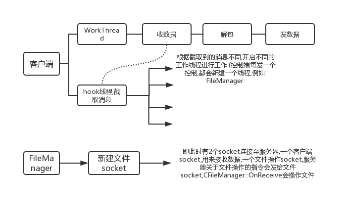
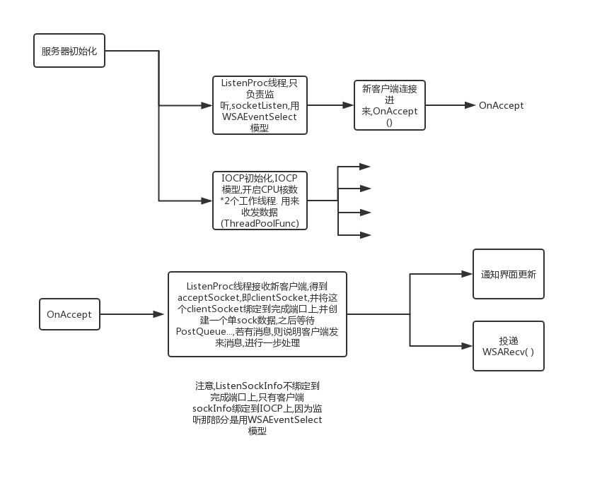

### ```CBuffer```类
1. ```CBuffer```类中,构造函数初始化临界区```InitializeCriticalSection(&m_cs)```,析构函数释放临界区```DeleteCriticalSection(&m_cs)```.
有关```windows```下临界区请看[这里](https://docs.microsoft.com/zh-cn/windows/desktop/api/synchapi/nf-synchapi-initializecriticalsection).
详解请看<< Windows核心编程 >>
2. ```CBuffer```类中,析构函数释放虚拟内存,即调用了这个```VirtualFree()```函数,请看这个[解析](https://docs.microsoft.com/en-us/windows/desktop/api/memoryapi/nf-memoryapi-virtualfree),还有[例子](https://docs.microsoft.com/zh-cn/windows/desktop/Memory/reserving-and-committing-memory)
3. ```Windows```中的内存映像文件是什么? 
4. ```CBuffer```中为何一直要
    ```CKeyboardManager::MyGetModuleFileName(NULL, szModule, MAX_PATH);```
    ```CKeyboardManager::MyGetShortPathName(szModule, szModule, MAX_PATH);```
    ```DeleteFile(szModule);```        
5. ```Buffer类```
这个类有几点值得注意的地方:  
- 用```CRITICAL_SECTION```即临界区,去保护这个```buffer```.同一时刻,只能有1个线程去读,写,访问这个```buffer```.
- 由于可能有多个**进程**,故```buffer```中的分配内存等都是分配的虚拟内存即虚拟地址空间.即用```VirtualAlloc()```和```VirtualFree()```.

### ```ClientSocket```类
1. ```ClientSocket```中:
   ```connect```方法: 有一句开启服务,但开启服务管理器的句柄为NULL.```StartService(NULL, NULL, NULL)``` ?
2. ```connect```方法: 开启TCP中的```keepAlive```机制
3. 析构函数还有```Disconnect()```都中出现这段代码:

        SC_HANDLE hSCM = OpenSCManager(NULL, NULL, SC_MANAGER_CREATE_SERVICE);
        ...
        CloseServiceHandle(hSCM);
    不知道有何作用?
4. ```Disconnect```方法: 里面有一个```LINGER```结构,设置为```1,0```.
        TCP关闭```socket```时,用以下语句:

        setsockopt(m_Socket, SOL_SOCKET, SO_LINGER, (char *)&lingerStruct, sizeof(lingerStruct));
        CancleIo((HANDLE)m_Socket);
    那么什么是```linger```,TCP关闭```socket```连接时,```linger```又起到了什么作用?
    [博客详解](https://segmentfault.com/a/1190000012345710?utm_source=tag-newest)
    ```CancleIo((HANDLE)m_Socket)```作用


### ```util```模块
该模块是将```CreateThread```函数又重新包装了一遍.
1. 在```MyCreateThread```函数中,使用了一个事件内核对象,```hEventTransferArg```它用来确保线程一定开启,且一定运行线程函数.否则就一直等待```WaitForSingleObject(hEventTransferArg,INFITE)```
            

### ```KeybordManager```模块
1. ```MyFuncInitializition()```方法: ```GetModuleHandle()```将```dll```文件,映射到当前进程的地址空间,并获得其基地址.然后再用```GetProcAddress(module,name)```获得这个```dll```文件中```name```函数的地址,也就是函数指针了.这样就可以拿```dll```文件中的函数过来用.   
但这里有一个问题,为何不直接调用```dll```文件的函数? 或者说```dll```文件中的函数是如何使用的?   
<<核心编程>>第19 20章.


## 对gh0st客户端线程的补充分析



- 关于WindowsHook的[介绍](https://blog.csdn.net/ljheee/article/details/52040233)

## 对gh0st服务器初始化流程


对于服务器发数据注意的事项: ```Send()```都是将应答数据解包写入```writebuffer```(CBuffer类,动态数组),写入后就等待发送. 而在```OnClientWriting()```中,将```wsaoutbuffer```指向```writebuffer```并发送,这样就解决发送动态大小的数据的问题.    
若```writebuffer```中没有发完(此处应该是用```writebuffer.Delete(dwIosize)```判断),则继续投递```WSASend```发.    
这里注意,```DoRecv()```后,投递完```Send请求```后,立即又```PostRecv```,我之前一直写的都是收到数据后,发送完回应数据再投递```Recv请求```.这样效率不高.   

但对于无法一次性收完数据时,gh0st没有交代,gh0st服务器认为收来的数据压缩后都可以放在一个8K的inbuffer中.默认一次就可以接收完.